<table>
    <tr>
        <td >
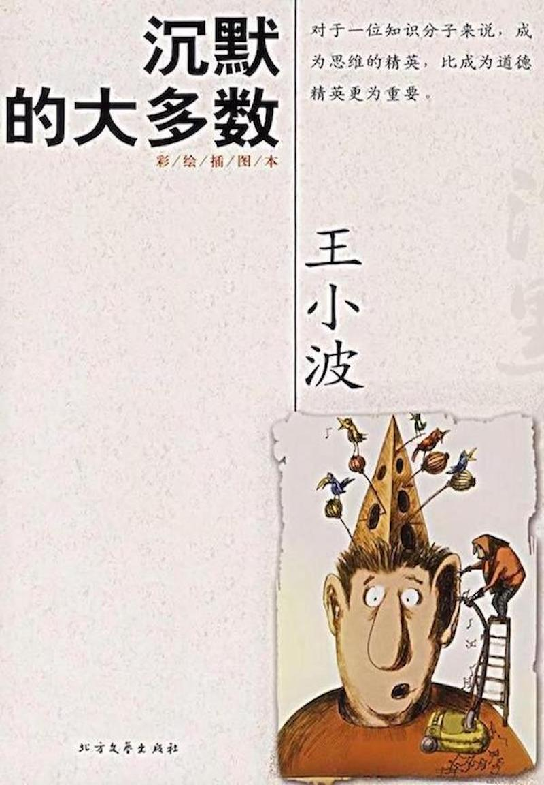《沉默的大多数》
</td>
        <td >
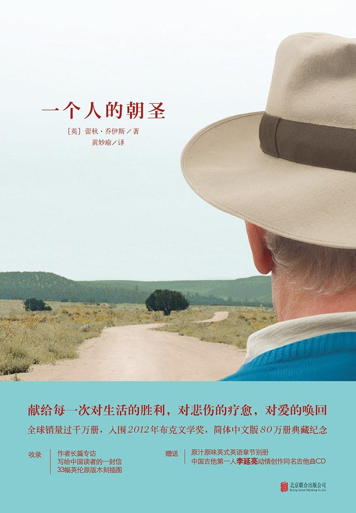《一个人的朝圣》
</td>
        <td>
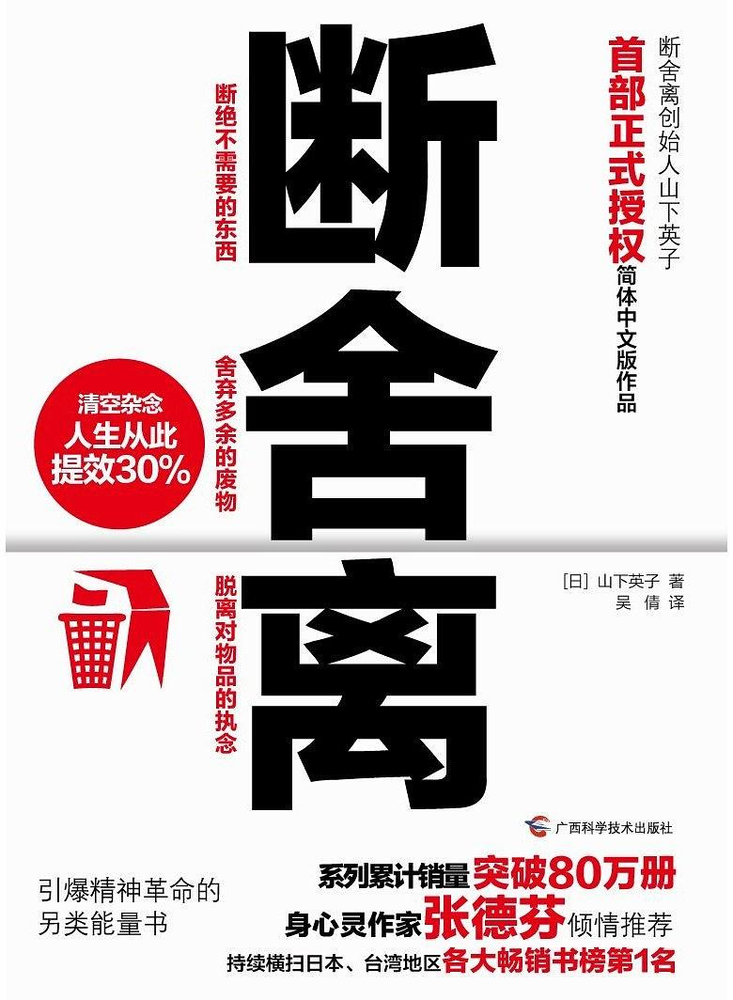《断舍离》
</td>
        <td>
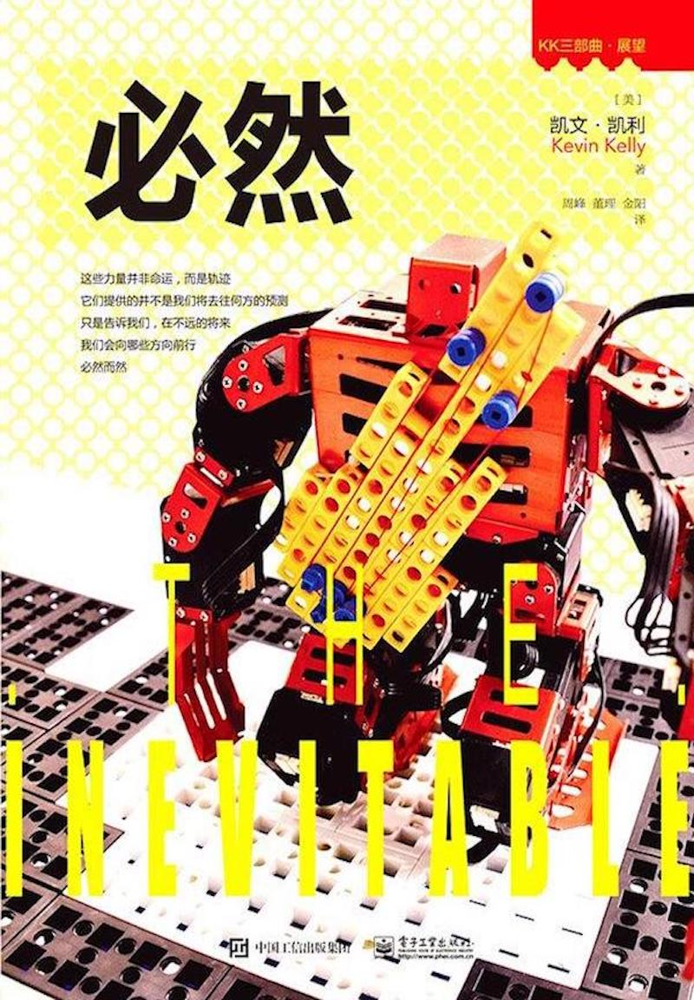《必然》
</td>
        <td>
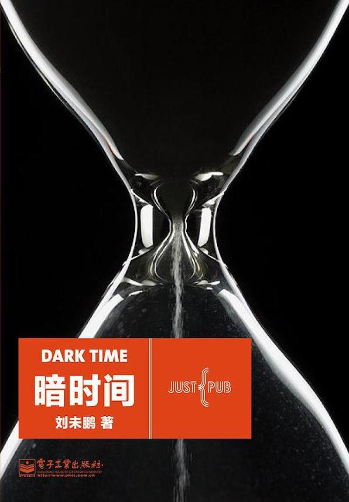《暗时间》
</td>
    </tr>   
    <tr>
        <td >
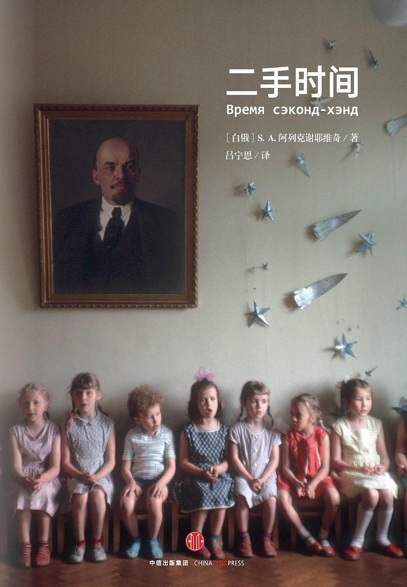《二手时间》
</td>
        <td >
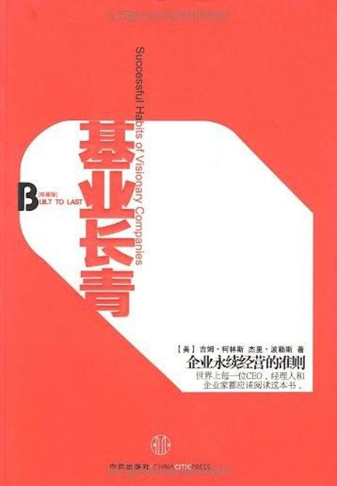《基业长青》
</td>
        <td>
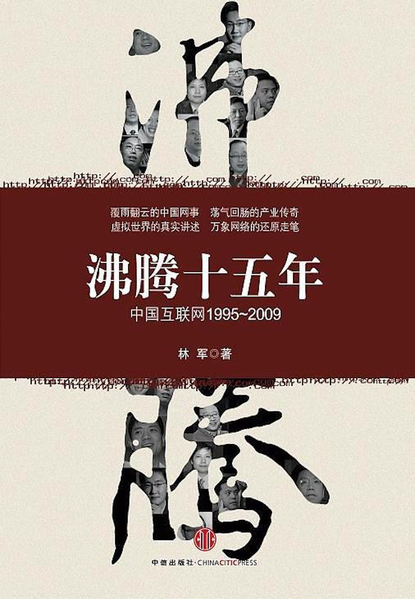《沸腾十五年》
</td>
        <td>
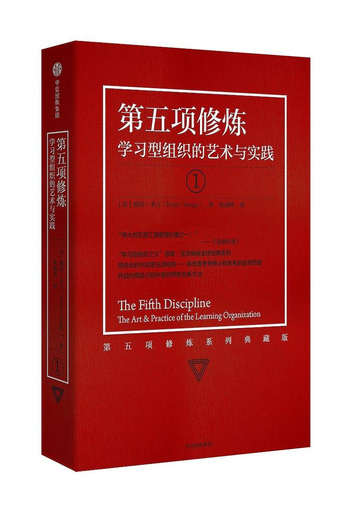《第五项修炼》
</td>
        <td>
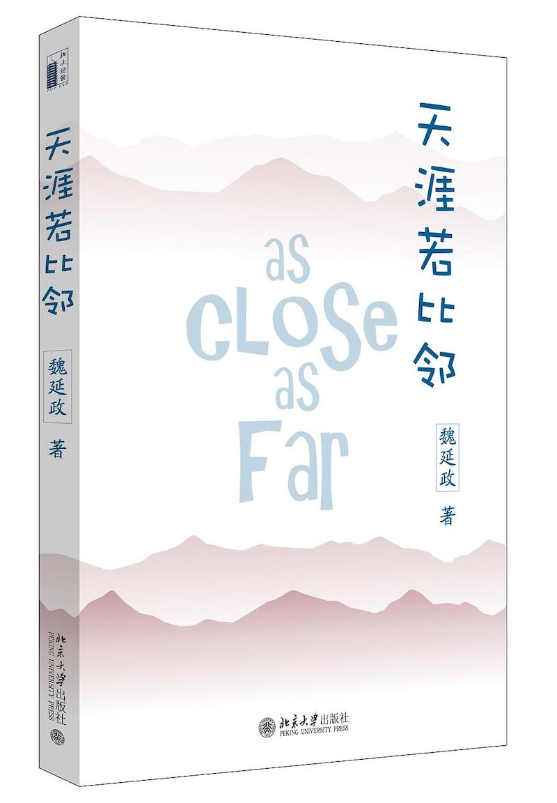《天涯若比邻》
</td>
    </tr>
    <tr>
        <td >
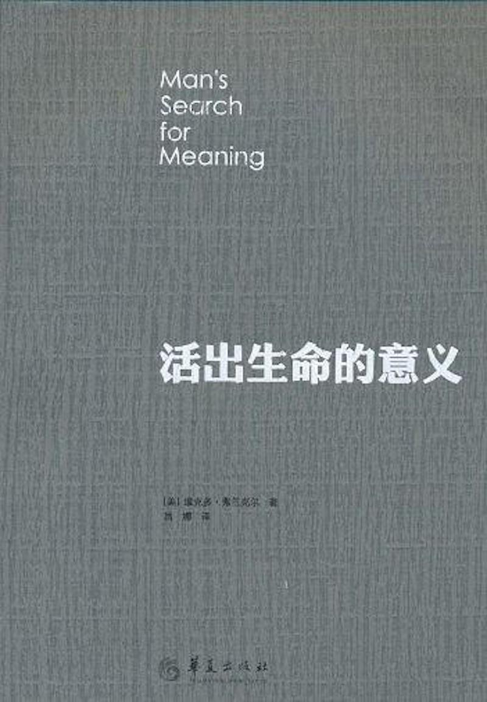《活出生命的意义》
</td>
        <td >
《从优秀到卓越》
</td>
        <td>
《追风筝的人》
</td>
    </tr>
</table>
